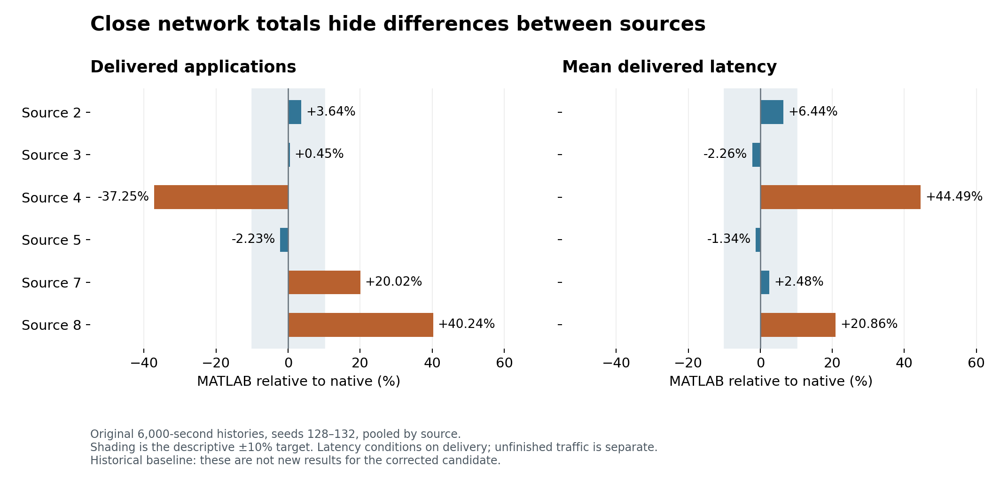
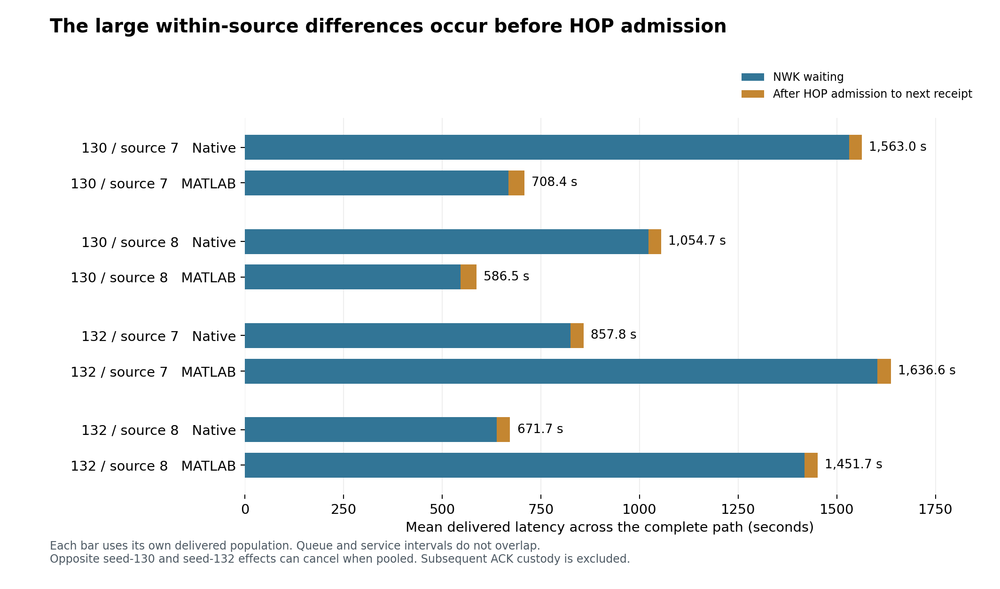

# Original 6,000-second CSR accounting and latency review

24 September 2026 · Historical accepted seeds 128–132 · Existing evidence only

**Source mix explains much of the overall mean-latency gap. Substantial differences in source allocation and NWK waiting remain after accounting for unfinished traffic and equal observation time. The original five-run evidence does not meet a general ±10% network-behavior claim.**

No new simulation ran and no production code changed. This review concerns the original T25 histories, which predate the grouped-routing cleanup correction. It does not measure the current candidate's 6,000-second performance.

The recovered September 21 latency archive already contained the original delivered-path and source-mix decomposition. The recent review had not recovered that archive and incorrectly treated those analyses as still missing. This work verifies and reuses them, then adds scheduled-attempt matching, complete source accounting, and fixed-age delivery comparisons that retain unsuccessful traffic.

## 1. Application accounting closes

| Across five runs | Native | MATLAB |
|---|---:|---:|
| Scheduled attempts | 8,550,000 | 8,550,000 |
| Admitted applications | 62,631 | 62,795 |
| Attempts not admitted | 8,487,369 | 8,487,205 |
| Unique applications delivered | 59,376 | 59,273 |
| Recorded terminal application drops | Unknown | 2,029 |
| Model-pending applications at stop | Unknown | 1,493 |
| Undelivered admissions with unresolved fate | 3,255 | 0 |

Native closure is 62,631 = 59,376 + 3,255. MATLAB closure is 62,795 = 59,273 + 2,029 + 1,493. Native's unresolved group can contain pending applications and unobserved terminal drops; it is not an additional group beyond undelivered admissions. Network delivery counts differ by only −0.17%, despite the source allocation differences below.

Every source has 1,425,000 scheduled attempts across the five runs: 50 attempts/s during [300, 6000) seconds in each run. Fresh seeds 131/132 have complete aggregate counters checked directly. For older seeds 128–130, attempt totals are schedule-derived and labelled accordingly. The original 100,000-row MATLAB admission-attempt prefix is incomplete, but all admitted-application histories and aggregate counters are retained. Missing prefix rows are not treated as individually observed rejects.

| Source | Native admitted | Native delivered | Native unresolved | MATLAB admitted | MATLAB delivered | MATLAB dropped | MATLAB pending |
|---|---:|---:|---:|---:|---:|---:|---:|
| 2 | 2,236 | 1,756 | 480 | 2,433 | 1,820 | 401 | 212 |
| 3 | 42,468 | 42,378 | 90 | 42,653 | 42,569 | 7 | 77 |
| 4 | 3,943 | 3,264 | 679 | 2,537 | 2,048 | 361 | 128 |
| 5 | 8,269 | 8,123 | 146 | 8,073 | 7,942 | 51 | 80 |
| 7 | 3,873 | 2,533 | 1,340 | 4,551 | 3,040 | 757 | 754 |
| 8 | 1,842 | 1,322 | 520 | 2,548 | 1,854 | 452 | 242 |

`ensemble/per_seed_source_accounting.csv` retains all 60 engine/seed/source rows, including not-admitted counts and count provenance. The pooled table retains all sources, including native seed 131 sources 2, 7 and 8, which admitted and delivered no applications.

A failed generator interrupt does not create a persistent application in this workload. The latency clock begins with an admitted application. Accordingly, delivered latency is not the age of every externally offered sensor message. Native `no_ack`, DACK expiry and physical receive failures are not global application-drop certificates: 1,029 delivered native seed-132 applications have at least one eventual `no_ack` hop completion on their reconstructed history. A receiver can progress while its upstream sender later retires ownership after lost feedback.

## 2. Comparable delivered means: composition matters, but does not close parity

| Explicit comparison | MATLAB | Native | Difference |
|---|---:|---:|---:|
| All delivered applications, pooled | 119.095 s | 97.997 s | +21.53% |
| Equal weight to each run's delivered mean | 118.950 s | 98.599 s | +20.64% |
| Six pooled sources, fixed native delivery weights | 107.357 s | 97.997 s | +9.55% |
| 27 common seed/source cells, fixed native delivery weights | 106.269 s | 97.997 s | +8.44% |

The last comparison has no native conditional means for seed 131 sources 2/7/8, so those three cells receive no weight in that diagnostic. It is not a replacement acceptance population. The six-source weighting retains all deliveries but pools different seed/topology histories inside each source. Equal weighting of the six pooled sources instead gives +11.53%, demonstrating that the weighting choice matters.

MATLAB delivered 1,304 applications from the three absent native seed/source cells, at a mean of 962.03 s. An exact arithmetic support decomposition assigns 19.009 s of the 21.098 s pooled mean difference to that unmatched portion relative to the native overall mean, and 2.089 s to the common-support remainder. This is descriptive accounting, not a causal prediction of what changing discovery would do.

A different, symmetric six-source decomposition assigns 11.787 s to source delivery weights and 9.311 s to within-source means. These are alternative partitions of the same gap and must not be added together. Source normalization can reduce the headline while allowing opposite seed-level errors to cancel. **Eleven of the 27 defined seed/source latency comparisons remain outside ±10%; three more are undefined.**

Pooled source 4 delivers 37.25% fewer applications in MATLAB and has 44.49% higher delivered latency. Source 8 delivers 40.24% more with 20.86% higher latency. Source 7's pooled mean differs by only 2.48%, while its delivery count differs by 20.02% and its individual seed delays vary greatly.

## 3. Unfinished traffic and equal observation windows

No unfinished application is assigned a delivery time at 6,000 seconds. The 1,493 MATLAB model-pending applications have mean age 553.66 s at the stop; 239 are older than 1,200 s. In seed 132, 298 source-7 applications remain pending, with mean age 1,072.34 s and maximum 2,151.44 s. These ages are not completed latencies or proof that every pending object occupies a particular queue. Native unresolved ages measure time since admission, without asserting live pending status.

For a deadline T, use scheduled generation times in **[300, 6000−T)** and count first delivery by generation + T. Every included attempt has full observation through its deadline; the exact end-boundary attempt is conservatively excluded. Drops, not-admitted attempts and undelivered applications do not become successful completions. No survival-model assumption is required.

For T = 1,200 s, each row below covers the same 225,000 scheduled attempts per source during **[300, 4800)**:

| Seed / source | Native delivered within 1,200 s / admitted | MATLAB delivered within 1,200 s / admitted |
|---|---:|---:|
| 130 / 7 | 199 / 1,162 = **17.13%** | 498 / 635 = **78.43%** |
| 130 / 8 | 79 / 165 = **47.88%** | 444 / 538 = **82.53%** |
| 132 / 7 | 536 / 657 = **81.58%** | 145 / 905 = **16.02%** |
| 132 / 8 | 307 / 373 = **82.31%** | 154 / 522 = **29.50%** |

The numerators are also comparable directly because both engines have 225,000 scheduled attempts in each cell. For example, seed 132 source 7 delivers 145 versus 536 applications within the deadline from equal offered interrupt counts. Its conditional-admission denominator differs because admission is itself part of the behavior being compared.

This preserves the reversal: MATLAB serves source 7 much faster in seed 130 and much slower in seed 132. Finite-stop selection does not erase that difference. The full export covers 60, 300, 600 and 1,200 s deadlines for all seeds/sources. Different deadlines use different eligible generation windows; those rows are not one common-cohort CDF.

Only 1,827 scheduled attempts are admitted in both engines and 1,726 are delivered in both. That shared-delivery subset is about 2.9% of either delivered population; 1,385 of its applications are source 3. Its mean difference of −5.79% is a strongly selected sensitivity result, not evidence that the complete network meets parity. Matching uses source, seed and the validated 20-ms scheduled-attempt index; all destinations are gateway 1. It does not use internal packet IDs or assume aligned random draws.

## 4. The remaining latency difference is mostly before HOP admission

For each first-delivered path, queue entry → HOP admission is NWK waiting; HOP admission → the next causal receipt is subsequent service. Sum those intervals along the actual path. Upstream ownership can continue after a relay has received the packet, so later ACK/DACK custody is excluded from this additive delivery-latency sum.

| Pooled source | Native delivered mean (s) | MATLAB delivered mean (s) | MATLAB−native NWK waiting (s) | MATLAB−native subsequent service (s) |
|---|---:|---:|---:|---:|
| 2 | 447.77 | 476.59 | +23.68 | +5.14 |
| 3 | 10.52 | 10.28 | -0.05 | -0.18 |
| 4 | 182.47 | 263.66 | +74.50 | +6.69 |
| 5 | 56.31 | 55.56 | -3.85 | +3.10 |
| 7 | 1032.85 | 1058.48 | +21.51 | +4.11 |
| 8 | 694.05 | 838.85 | +140.31 | +4.49 |

For the 27 common seed/source cells with native weights, the +8.272 s total difference separates into **+7.164 s NWK waiting and +1.108 s subsequent service**. For pooled source 4, 74.50 s of its 81.19 s excess lies before HOP admission. For pooled source 8, 140.31 s of its 144.80 s excess lies there.

The large individual cases show the same location:

| Seed / source | Engine | Mean NWK waiting (s) | Mean subsequent service (s) | Total delivered latency (s) |
|---|---|---:|---:|---:|
| 130 / 7 | Native | 1,531.49 | 31.53 | 1,563.02 |
| 130 / 7 | MATLAB | 667.82 | 40.54 | 708.36 |
| 132 / 7 | Native | 825.00 | 32.84 | 857.84 |
| 132 / 7 | MATLAB | 1,602.28 | 34.32 | 1,636.61 |
| 132 / 8 | Native | 637.89 | 33.82 | 671.71 |
| 132 / 8 | MATLAB | 1,418.05 | 33.61 | 1,451.66 |

In seed 132 source 7, node 2 contributes about 1,119.14 s of MATLAB NWK waiting versus 196.18 s native. After admission at that node, receipt at node 4 averages about 2.07 versus 2.19 s. Existing capacity analysis shows persistent pressure from adaptive per-peer windows and DACK-held capacity. That establishes where the queue is sustained; it does not prove an erroneous timer or queue rule.

MATLAB logical transmit records additionally separate initial access, elapsed first-to-last transmission attempts, and last transmission to causal receipt. The retry span includes timer and medium-access delays, not exclusively airtime. Original native physical traces expose only aggregate-front packets, so an equally complete native per-application split of first-TX waiting and retry delay is unavailable. The supported cross-engine comparison is the two-phase NWK/subsequent-service decomposition. Missing detail is left missing rather than inferred from unrelated physical sequence numbers.

## 5. Decision and next step

The existing-evidence question is now answered: **the overall mean is strongly affected by source composition, while substantial within-source delivery and queueing differences persist under full deadline observation.** The original results support close total deliveries, not a general ±10% claim for source allocation or latency.

No specific new production mismatch is established by this audit. The recent common-input MAC, receiver and ACK/NWK results constrain particular rules; they do not reproduce the full autonomous arrival, contention, feedback and capacity histories that generate these long backlogs. A queue wait is an outcome of those histories, not sufficient evidence that its queue implementation should be changed.

Stop this historical analysis here. The next useful performance milestone, if commissioned, is **one current-candidate 6,000-second acceptance batch on the existing seeds 131 and 132**, reusing the already bound native references. Record complete admitted-application identities, source counters, final outcomes and causal queue/admission/receipt stages in that one batch. Score the same per-source allocation and fixed-age metrics together; retain unknown native terminal fates explicitly. This would measure the grouped-routing-corrected candidate, rather than assigning old T25 percentages to it. It would refresh those two histories only, not silently renew a five-seed claim. No such simulation or new owner kit has been started here.

A further diagnostic or code fix should target a consequential residual from that version-matched evidence. A generic capacity replay, an arbitrary additional seed or adjustment of a timing constant is not justified by the present accounting.

## Verification and evidence

- Recovered the original T25 owner ZIP exactly: SHA-256 `d215f2b5ecb2ac5cc6213d77ce5bd631a9609fb46460e1798b7e3e3d2c9cd436`.
- Verified all 76 files in the recovered original latency package manifest. Older seeds 128–130 retain that archived validation/source provenance; their raw traces were not newly reparsed in this review.
- Recomputed MATLAB seed-131/132 packet and causal-hop CSVs from the exact owner ZIP; all four files are byte-identical to the archived analysis. All 23,839 delivered paths close exactly after nanosecond normalization.
- Revalidated native seed-131/132 against original full traces: 25,090 admitted applications and 30,320 delivered causal hops, with exact integer-nanosecond path closure and phase agreement. Distinct same-time copies are checked as a multiset using event lineage.
- Reproduced 210 accepted metrics and independently checked 2,192 ensemble fields, including all 60 source/seed outcome rows and all 336 fixed-age rows. Recorded schedule-grid residuals are below a picosecond after the admitted timestamp parsing used for joins.

The evidence ZIP includes reproducible population analysis, complete admitted-packet and hop ledgers, per-seed/source accounting, phase metrics, unfinished ages, deadline results, figures, raw-validation reports and hashes. Raw-trace regeneration requires the separately preserved original large archives; the shipped ensemble and arithmetic review can be reproduced from included inputs. These are historical evidence artifacts, not a MATLAB update package.
